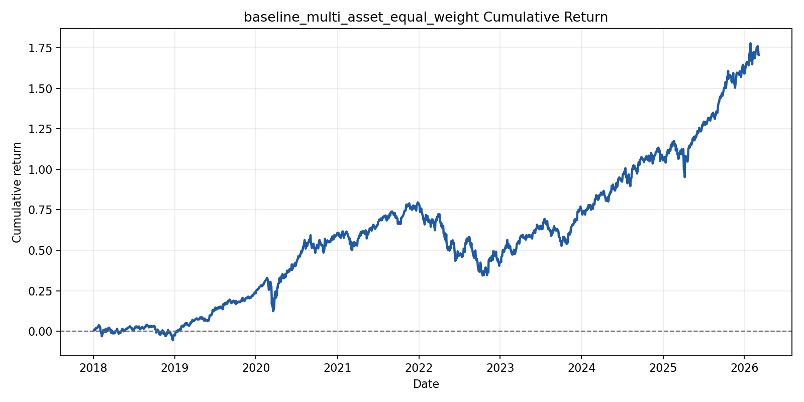
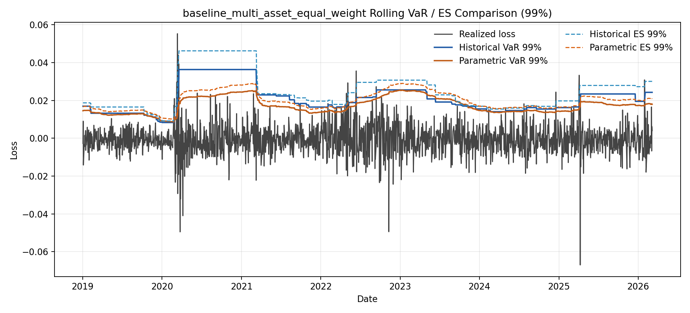
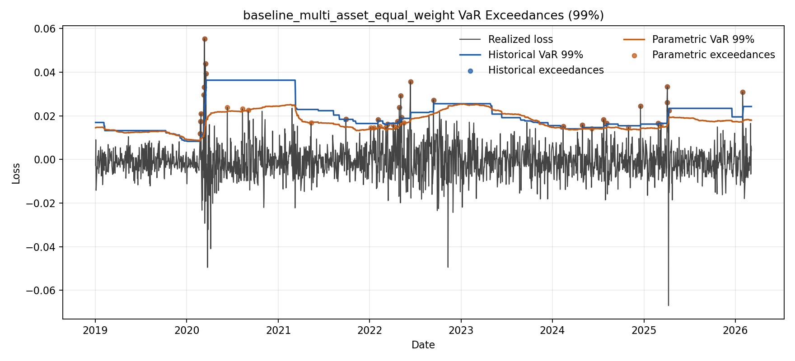

# Market Risk / Model Validation Toolkit

Python portfolio project that simulates a bank-style market risk and model validation workflow for a liquid multi-asset book. The repository ingests public market data, builds transparent ETF-based portfolios, estimates rolling historical and parametric VaR / ES, backtests those forecasts with coverage and independence tests, runs deterministic stress scenarios, and packages the results into report-ready artifacts.

## Why This Matters

Market risk and model validation roles are not just about fitting models. They require the ability to:

- prepare and sanity-check market data
- turn positions into portfolio-level risk measures
- explain model assumptions clearly
- test whether VaR forecasts actually perform as intended
- communicate weaknesses, not just outputs

This project is designed to show those skills in a recruiter-friendly way. It focuses on transparent methodology, reproducible outputs, and validation-style interpretation rather than black-box modeling or inflated production claims.

## What The Repo Does

- Downloads and validates daily adjusted-close data for `SPY`, `QQQ`, `TLT`, and `GLD`
- Builds equal-weight and custom-weight portfolios from a clean aligned return panel
- Computes rolling one-day historical and Gaussian VaR / ES at 95% and 99%
- Backtests VaR with exception counts, Kupiec coverage, and Christoffersen conditional coverage
- Runs deterministic stress scenarios with asset-level contribution breakdowns
- Produces markdown- and CSV-friendly outputs suitable for a validation memo
- Includes unit and integration tests across the full workflow

## Sample Results

### Baseline Equal-Weight Portfolio

From [baseline_multi_asset_equal_weight_summary.csv](data/artifacts/baseline_multi_asset_equal_weight_summary.csv):

| Metric | Value |
| --- | ---: |
| Annualized return | 12.98% |
| Annualized volatility | 12.26% |
| Sharpe ratio | 1.06 |
| Max drawdown | -25.15% |

### VaR / ES Snapshot

From [baseline_multi_asset_equal_weight_risk_summary.csv](data/artifacts/baseline_multi_asset_equal_weight_risk_summary.csv):

| Confidence | Metric | Historical | Parametric |
| --- | --- | ---: | ---: |
| 95% | Mean VaR | 1.157% | 1.210% |
| 95% | Mean ES | 1.716% | 1.530% |
| 99% | Mean VaR | 2.080% | 1.732% |
| 99% | Mean ES | 2.500% | 1.992% |

### Backtesting Takeaway

From [baseline_multi_asset_equal_weight_backtest_summary.csv](data/artifacts/baseline_multi_asset_equal_weight_backtest_summary.csv):

- Historical VaR at 95% is the strongest result: exception frequency is close to target and conditional coverage is not rejected.
- Parametric VaR at 95% has acceptable coverage but shows exception clustering.
- Both 99% models underperform.
- Parametric VaR at 99% is the weakest specification, with `41` exceptions over `1804` observations versus an expected `1%` tail rate.

### Stress Testing Takeaway

From [baseline_multi_asset_custom_stress_summary.csv](data/artifacts/baseline_multi_asset_custom_stress_summary.csv):

| Scenario | Portfolio PnL |
| --- | ---: |
| Equity selloff | -4.65% |
| Inflation surprise | -4.20% |
| Cross-asset mix | -3.45% |
| Rates shock | -2.73% |

The broad equity selloff is the largest loss scenario, driven primarily by `SPY` and `QQQ`.

## Figures

These are the most useful recruiter-facing visuals in the repo:

- 
- 
- 
- 

Suggested screenshots if you want to feature this project externally:

1. The VaR / ES comparison chart
2. The exceedance plot
3. The stress scenario bar chart
4. A cropped view of [reports/sample_validation_report.md](reports/sample_validation_report.md)

## Report

The best single-file walkthrough is the validation memo:

- [Sample validation report](reports/sample_validation_report.md)

A reviewer should be able to understand the project from that report alone without reading source code first.

## Repo Structure

```text
.
├── configs/                  # Portfolio, risk, validation, and stress YAML configs
├── data/
│   ├── raw/                  # Raw downloaded prices and metadata
│   ├── processed/            # Clean aligned price and return panels
│   └── artifacts/            # CSV / markdown outputs from each stage
├── reports/
│   ├── figures/              # Recruiter-facing charts
│   └── sample_validation_report.md
├── src/market_risk_toolkit/
│   ├── data/                 # Ingestion and validation pipeline
│   ├── portfolio/            # Portfolio construction and summary stats
│   ├── risk/                 # Rolling VaR / ES engine
│   ├── validation/           # Backtesting and model validation tests
│   └── stress/               # Deterministic scenario engine
└── tests/                    # Unit and integration coverage
```

## Setup

```bash
python -m venv .venv
source .venv/bin/activate
python -m pip install --upgrade pip
pip install -r requirements.txt
pytest
```

The project uses a `src/` layout and installs in editable mode through [requirements.txt](requirements.txt).

## Run The Full Workflow

```bash
python -m market_risk_toolkit.data --config configs/data_pipeline.yaml
python -m market_risk_toolkit.portfolio --config configs/portfolios/example_portfolio.yaml
python -m market_risk_toolkit.risk --config configs/risk_engine.yaml
python -m market_risk_toolkit.validation --config configs/validation_engine.yaml
python -m market_risk_toolkit.stress --config configs/stress_engine.yaml
```

Primary generated outputs:

- [data/artifacts/data_validation_summary.json](data/artifacts/data_validation_summary.json)
- [data/artifacts/baseline_multi_asset_equal_weight_summary.csv](data/artifacts/baseline_multi_asset_equal_weight_summary.csv)
- [data/artifacts/baseline_multi_asset_equal_weight_rolling_var_es.csv](data/artifacts/baseline_multi_asset_equal_weight_rolling_var_es.csv)
- [data/artifacts/baseline_multi_asset_equal_weight_backtest_summary.csv](data/artifacts/baseline_multi_asset_equal_weight_backtest_summary.csv)
- [data/artifacts/baseline_multi_asset_custom_stress_summary.csv](data/artifacts/baseline_multi_asset_custom_stress_summary.csv)
- [reports/sample_validation_report.md](reports/sample_validation_report.md)

## Business Relevance

This repo is most relevant for:

- Market Risk Analyst / Market Risk Quant roles
- Model Validation / Model Risk roles
- Quantitative Risk Analyst positions
- Risk Strats / Risk Analytics teams

The main business value is not the exact ETF universe. It is the workflow discipline:

- explicit model assumptions
- reproducible calculations
- testable code
- interpretable diagnostics
- willingness to show where a model fails

## Limitations

- Uses public ETF proxies instead of real desk positions or sensitivities
- Relies on `yfinance`, which is suitable for prototyping but not production controls
- Parametric VaR / ES assumes normal returns and is intentionally simplistic
- Stress testing is deterministic and static, not path-dependent or liquidity-aware
- The stress section uses a custom-weight portfolio while the core backtesting section uses the equal-weight baseline
- The project is not presented as a regulatory capital engine or production monitoring framework

## Future Work

- Add regime segmentation for calm versus stressed periods
- Add filtered historical simulation or EVT-style tail modeling
- Add factor-based and portfolio-level attribution for stress scenarios
- Use a single portfolio consistently across risk, validation, and stress sections
- Add automated report build and CI publishing

## Resume-Ready Bullets

- Built a Python market risk toolkit for a multi-asset ETF portfolio with rolling historical and parametric VaR / ES estimation, formal backtesting, and deterministic stress testing.
- Implemented VaR validation using exception analysis, Kupiec coverage, and Christoffersen conditional coverage tests, showing where Gaussian tail assumptions break down.
- Designed config-driven data, portfolio, risk, validation, and stress workflows with reproducible CSV and markdown artifacts for report-ready risk communication.
