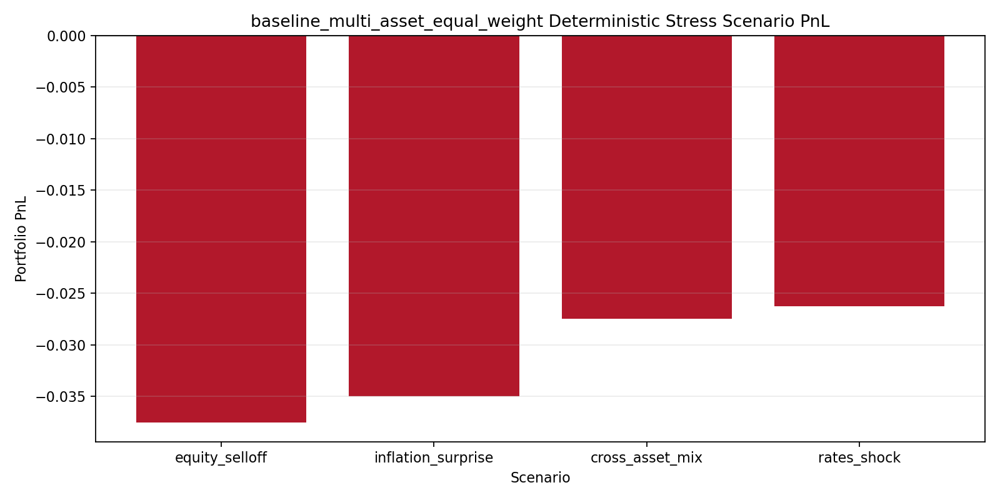

# Sample Market Risk / Model Validation Report

## 1. Objective

This project demonstrates a small but disciplined market risk workflow for a liquid multi-asset portfolio. The objective is not to replicate a production risk platform, but to show a credible end-to-end process for:

- preparing daily market data
- constructing a transparent portfolio
- estimating one-day VaR and Expected Shortfall
- backtesting those VaR forecasts
- applying deterministic stress scenarios
- summarizing findings in a validation-style memo

## 2. Data And Portfolio Setup

### Data

- Instruments: `SPY`, `QQQ`, `TLT`, `GLD`
- Data source: `yfinance`
- Price field: adjusted close
- Raw sample window: January 2, 2018 to March 9, 2026
- Clean aligned return window: January 3, 2018 to March 6, 2026
- Daily return observations: `2054`

Reference:
- [Data validation summary](../data/artifacts/data_validation_summary.json)

The data validation pipeline flagged one partially missing date on March 9, 2026 and removed it from the aligned panel. No duplicate dates or non-monotonic index issues were detected.

### Portfolio

The main risk and backtesting results below use a baseline equal-weight portfolio with 25% in each ETF proxy. This keeps the core VaR comparison easy to interpret.

| Metric | Value |
| --- | ---: |
| Annualized return | 12.98% |
| Annualized volatility | 12.26% |
| Sharpe ratio | 1.06 |
| Max drawdown | -25.15% |

References:
- [Portfolio summary table](../data/artifacts/baseline_multi_asset_equal_weight_summary.csv)
- [Portfolio time series](../data/artifacts/baseline_multi_asset_equal_weight_timeseries.csv)
- 

## 3. VaR / ES Methodology

The risk engine estimates one-day loss measures on a rolling 250-day window at the 95% and 99% confidence levels.

### Historical VaR / ES

- Historical VaR is the empirical lower-tail quantile of portfolio returns.
- Historical ES is the average return in the tail beyond the VaR cutoff.

### Parametric VaR / ES

- Parametric VaR assumes returns are approximately Gaussian over the one-day horizon.
- Parametric ES uses the corresponding closed-form Gaussian tail expectation.

This model is intentionally included as a benchmark rather than a claim of realistic tail behavior. Its main value here is interpretability and a clear contrast with historical estimates.

Reference:
- [Rolling VaR / ES summary](../data/artifacts/baseline_multi_asset_equal_weight_risk_summary.csv)

Key averages from the rolling sample:

| Confidence | Metric | Historical | Parametric |
| --- | --- | ---: | ---: |
| 95% | VaR | 1.157% | 1.210% |
| 95% | ES | 1.716% | 1.530% |
| 99% | VaR | 2.080% | 1.732% |
| 99% | ES | 2.500% | 1.992% |

References:
- [Rolling VaR / ES table](../data/artifacts/baseline_multi_asset_equal_weight_rolling_var_es.csv)
- 

## 4. Backtesting Results

Backtesting compares realized one-day loss `-r_t` to the VaR forecast generated from the prior rolling window. This avoids look-ahead leakage and supports proper exception analysis.

The validation layer includes:

- exception counts
- Kupiec unconditional coverage
- Christoffersen independence
- Christoffersen conditional coverage

Reference:
- [Backtesting summary table](../data/artifacts/baseline_multi_asset_equal_weight_backtest_summary.csv)
- [Exceedance table](../data/artifacts/baseline_multi_asset_equal_weight_backtest_exceedances.csv)
- 

### Interpretation

1. Historical VaR at 95% performs best in this sample. Exception frequency is close to target and conditional coverage is not rejected.
2. Parametric VaR at 95% has acceptable unconditional coverage, but exception clustering weakens conditional coverage.
3. Both 99% models underperform. Historical 99% slightly exceeds the target exception rate and fails conditional coverage.
4. Parametric 99% is the weakest result: `41` exceptions versus an expected rate of `1%`, with strong rejection from both coverage and conditional coverage tests.

This is a useful validation conclusion: the Gaussian model is serviceable as a simple benchmark at 95%, but it is not reliable in the far tail for this portfolio sample.

## 5. Stress Testing Results

Stress testing is run on the same equal-weight baseline portfolio used in the risk and backtesting sections:

- `SPY`: 25%
- `QQQ`: 25%
- `TLT`: 25%
- `GLD`: 25%

Reference:
- [Stress summary table](../data/artifacts/baseline_multi_asset_equal_weight_stress_summary.csv)
- [Stress contribution table](../data/artifacts/baseline_multi_asset_equal_weight_stress_contributions.csv)
- [Stress markdown summary](../data/artifacts/baseline_multi_asset_equal_weight_stress_summary.md)
- 

Scenario outcomes:

| Scenario | Portfolio PnL |
| --- | ---: |
| Equity selloff | -3.75% |
| Inflation surprise | -3.50% |
| Cross-asset mix | -2.75% |
| Rates shock | -2.63% |

The largest loss comes from the broad equity selloff scenario, driven mainly by `SPY` and `QQQ`. The inflation surprise remains material because the equal-weight allocation leaves the portfolio fully exposed to the bond selloff in `TLT` while only partially offsetting it with `GLD`.

## 6. Limitations

- The project uses public ETF proxies rather than institution-specific positions, factors, or sensitivities.
- Data comes from a public source and is suitable for prototyping, not formal production controls.
- Parametric VaR / ES assumes normal returns and therefore understates tail complexity.
- Stress testing is deterministic and static; it does not include second-order effects, liquidity, or path dependency.
- No claims are made here about regulatory capital, production monitoring, or model governance completeness.

## 7. Next Steps

- Add regime segmentation so exception behavior can be compared across calm and stressed periods.
- Extend the VaR engine with filtered historical simulation or EVT-style tail modeling.
- Add portfolio-level attribution and factor-style scenario definitions.
- Package this markdown output into a reproducible report build step.

## 8. Overall Conclusion

The project demonstrates the workflow expected in a market risk / model validation setting: data preparation, portfolio construction, rolling VaR / ES estimation, formal backtesting, deterministic stress testing, and concise written interpretation.

The main validation takeaway is straightforward: a historical approach is more credible than the Gaussian benchmark for this sample, especially at the 99% tail where the parametric model materially underestimates risk.
